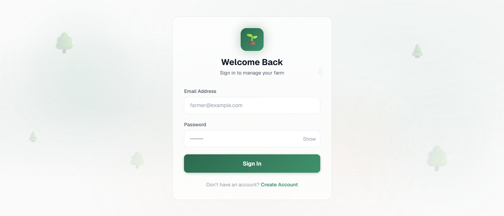
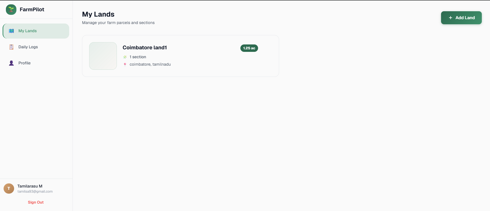
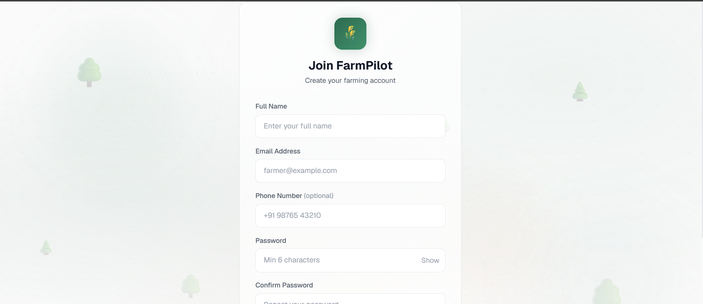
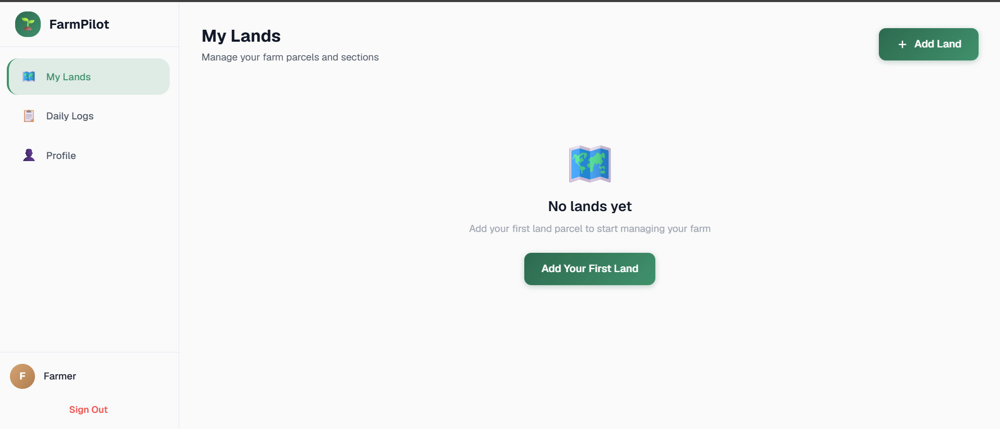
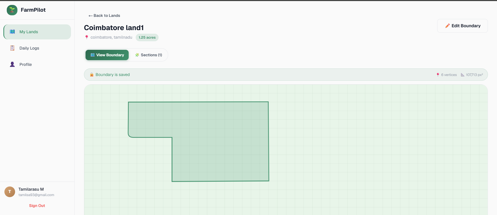
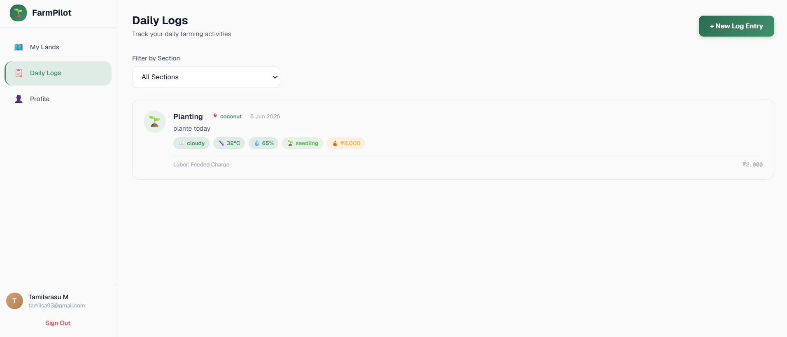
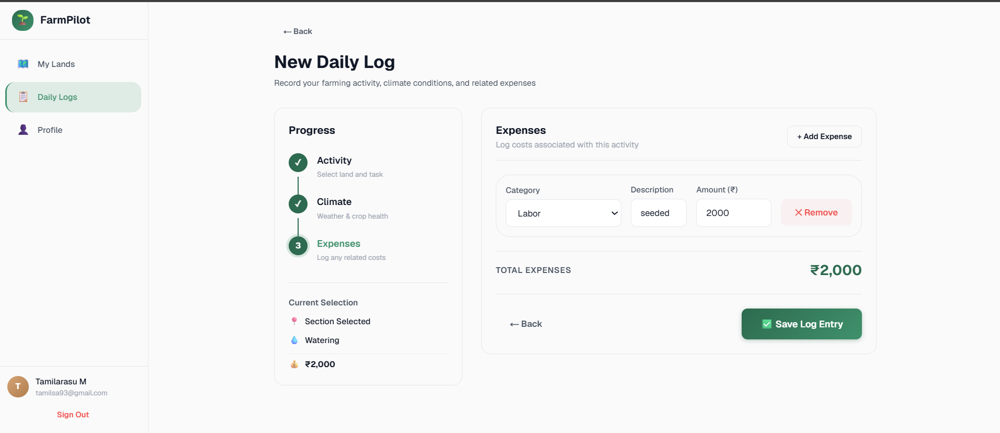

# Farm Pilot

Farm Pilot is a modern, intuitive dashboard application designed for farmers to efficiently manage their agricultural operations. Built with Next.js and Tailwind CSS, it provides a seamless user experience for tracking lands, sections, crops, and daily farming activities.

## 📸 Screenshots

| Login / Register | Dashboard |
| :---: | :---: |
|  |  |
|  |  |

| Land Management | Daily Logs |
| :---: | :---: |
|  |  |
| |  |


## 🌟 Features

- **Land Management**: Easily add and manage multiple parcels of land.
- **Section & Crop Tracking**: Divide your land into sections, assign specific crops, and monitor their progress.
- **Daily Activity Logs**: Record daily farming activities (planting, watering, fertilizing, harvesting, etc.) along with weather conditions, crop stages, and related expenses.
- **Unified Dashboard**: View all your agricultural data at a glance with an intuitive, dynamic interface.

## 🚀 Tech Stack

- **Framework**: [Next.js 16](https://nextjs.org/)
- **Language**: TypeScript
- **Styling**: Tailwind CSS
- **State Management**: [Zustand](https://zustand-demo.pmnd.rs/)
- **Data Fetching**: [TanStack React Query](https://tanstack.com/query/latest)

## 📦 Installation

1. **Clone the repository**:

   ```bash
   git clone <repository-url>
   cd farm-pilot
   ```

2. **Install dependencies**:

   ```bash
   npm install
   # or
   yarn install
   # or
   pnpm install
   ```

3. **Set up Environment Variables**:
   Create a `.env.local` file in the root directory and add the following:
   ```env
   NEXT_PUBLIC_API_URL=http://localhost:8000
   ```

## 🛠️ Running the App

To start the development server:

```bash
npm run dev
# or
yarn dev
# or
pnpm dev
```

Open [http://localhost:3000](http://localhost:3000) with your browser to see the result.

## 🤝 Contributing

Contributions, issues, and feature requests are welcome!

## 📄 License

This project is licensed under the MIT License.
